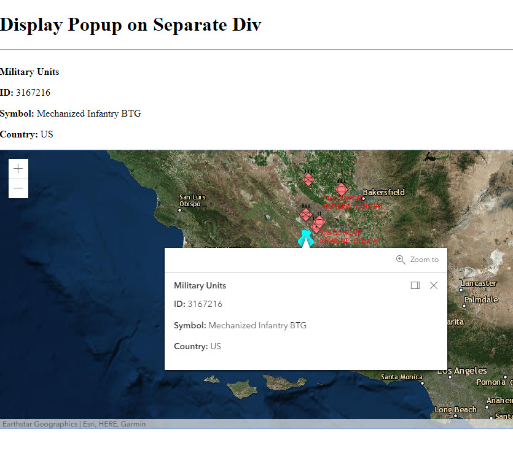

# Display Popup Content on Separate div from the Map Container

This project uses the ArcGIS JavaScript API 4.x to display the content of a popup on a separately created div. The application calls the 'watch' method on the MapView popup's 'visible' property. Once the popup is visible, it waits for the content to become defined in the 'viewModel' property. Then it sets the innerHTML of the separate div to the viewModel's content.

## Getting Started

This html file is ready for deployment. The FeatureLayer used is the following point feature service from sampleserver6.arcgisonline.com:
https://sampleserver6.arcgisonline.com/arcgis/rest/services/Military/FeatureServer/6

## How to use the sample

Run the application, and wait for the FeatureLayer to load.
Once it is done loading, then click on one of the feature symbols in the MapView. The popup for the feature will display, and the content will also appear at the top of the map.

## Deployment
One can deploy the application over a local web server (example: ISS), but it can also be ran directly from your computer by double clicking the html file when downloaded.

## Built With

* [ArcGIS JavaScript API](https://developers.arcgis.com/javascript/) - Using the 4.10 JavaScript API

## Relevant API
* Map
* MapView
* FeatureLayer
* watchUtils
